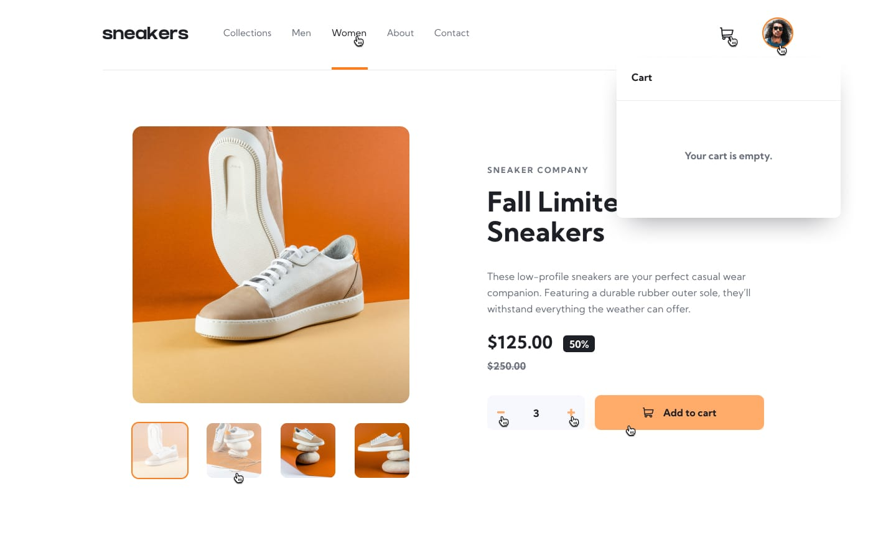
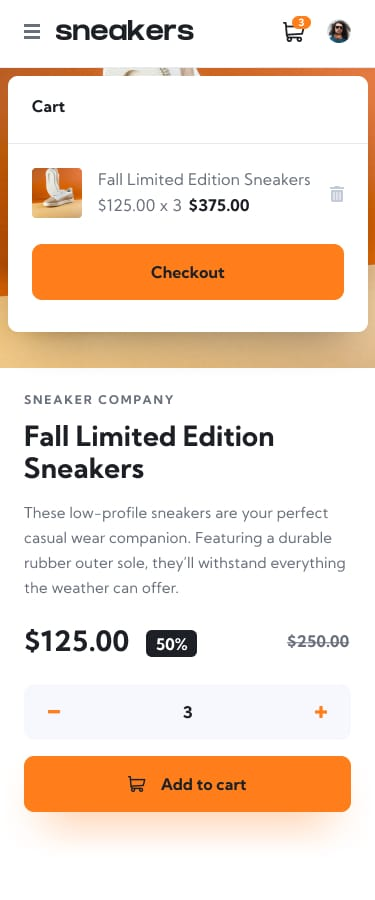

# 🛒 E-Commerce Store

A modern and responsive E-Commerce Store built using **HTML5**, **SCSS**, and **Vanilla JavaScript**. This project focuses on clean architecture, reusable components, and modern JavaScript best practices without using any frontend framework.

---

## 🚀 Features

- ✅ Responsive Design
- ✅ Modern Navigation Bar
- ✅ Product Listing
- ✅ Product Details Page
- ✅ Image Gallery & Slider
- ✅ Thumbnail Image Selection
- ✅ Shopping Cart
- ✅ Add to Cart
- ✅ Remove from Cart
- ✅ Increase / Decrease Quantity
- ✅ Cart Badge Counter
- ✅ LocalStorage Persistence
- ✅ Dynamic Price Calculation
- ✅ Subtotal Calculation
- ✅ Mobile Friendly
- ✅ Clean UI
- ✅ Modular JavaScript Architecture

---

## 📂 Project Structure

```
Ecommerce-product-page-coding-challenge/
│
├── index.html
│
├── design/ home-page + product-page
├── images
│      └──  icons/
│
├── api/
│   └── products.json
│
├── public/ css/
│   └── style.css
│
├── scss/
│   ├── components/ buttons + cart
│   ├── helpers/ mixin + variables + shared class
│   ├──layout/ body + header
│   ├── utilities/
│   └── style.scss
│
├── src /
│       └──  js/
│          ├── cart.js
│          ├── home-page.js
│          │   ├──slider
│          │   ├── storage.js
│          ├── navBar.js
│          └──  helpers.js
├── main.scss
└── README.md
```

---

# 🧰 Technologies Used

- HTML5
- SCSS (Sass)
- CSS
- JavaScript (ES6+)
- Fetch API
- LocalStorage
- JSON

---

# 📱 Responsive Design

The website is fully responsive and optimized for:

- Desktop
- Laptop
- Tablet
- Mobile

---

# 🛍 Shopping Cart Features

- Add products to cart
- Remove products
- Increase quantity
- Decrease quantity
- Calculate subtotal
- Save cart in LocalStorage
- Restore cart after page refresh
- Update cart badge automatically

---

# 🖼 Product Gallery

Each product contains:

- Main Image
- Thumbnail Images
- Previous Button
- Next Button
- Image Slider

---

# 📦 Product Data

Products are loaded dynamically from a JSON file using the Fetch API.

Example:

```json
{
    "id": 1,
    "name": "Sneakers",
    "price": 125,
    "images": ["image1.jpg", "image2.jpg", "image3.jpg"]
}
```

---

# ⚙️ JavaScript Modules

This project is divided into reusable modules.

### Fetch

- Fetch products
- Handle errors

### UI

- Display products
- Display product details
- Update badge

### Cart

- Add item
- Remove item
- Update quantity
- Calculate subtotal

### Slider

- Previous image
- Next image
- Thumbnail selection

### Storage

- Save cart
- Load cart

---

# 💾 LocalStorage

The application stores:

- Shopping Cart
- Cart Badge
- Selected Product

This allows users to continue shopping after refreshing the page.

---

# 🎯 Learning Objectives

This project was built to practice:

- DOM Manipulation
- ES6 JavaScript
- Fetch API
- LocalStorage
- Event Handling
- Modular Programming
- Responsive Web Design
- SCSS Architecture
- Clean Code Principles

---

# ▶️ Getting Started

1. Clone the repository

```bash
git clone https://github.com/amhsimo007/Ecommerce-Product-Page.git
```

2. Open the project folder.

3. To start this project you must run in the terminal:

---

## npm install

And to modify and access the page you must :

---

## npm run build

---

## npm run server

Then the open index.html whit live server or double click.

4. Enjoy!

---

# 📸 Screenshots

Add screenshots of your project here.

<figure>




</figure>

```
Home Page

Product Details

Shopping Cart

Mobile Version
```

---

# 🤝 Contributing

Contributions are welcome.

Feel free to fork the repository and submit a Pull Request.

---

# 📄 License

This project is licensed under the MIT License.

---

# 👨‍💻 Author

**’Mohamed Amahzoune**

Learning JavaScript by building real-world projects.

GitHub:
https://github.com/amhsimo007

---

⭐ If you like this project, don't forget to give it a star!

